```{r setup, include=FALSE}

knitr::opts_chunk$set(echo = TRUE)

knitr::opts_chunk$set(
  fig.align="center", 
  fig.retina = 2,
  cache=F#, echo=F, warning=F, message=F
  )

#knitr::opts_chunk$set(fig.dim=c(4.8, 4.5), fig.retina=2, out.width="100%")

# install package management tool pacman
# install.packages("pacman")

# devtools::install_github("CorrelAid/datenguideR")

pacman::p_load(
  tidyverse,
  showtext,
  dagitty,
  ggdag,
  data.table,
  patchwork,
  rvest
)


knitr::opts_chunk$set(
  message = FALSE,
  warning = FALSE
)

```


```{r set-ggplot-theme, include=FALSE}

theme_set(theme_classic() +
  theme(
    text = element_text(family = "plex", size = 25, colour="#415564"),
    panel.background = element_rect(fill = "#f6f3f2"), 
    plot.background = element_rect(fill = "#f6f3f2", color = "#f6f3f2"), 
    panel.grid.major = element_line(colour="#e8e8e8"),
    panel.grid.minor = element_blank(), 
    legend.background = element_rect(fill = "#f6f3f2"), 
    legend.box.background = element_rect(fill = "#f6f3f2"), 
    axis.text = element_text(colour="#415564"),
    axis.line = element_line(colour="#415564"),
    axis.title = element_text(colour="#415564"),
    axis.ticks = element_line(colour="#415564"),
  ))

purple <- "#644155"

```


```{r xaringan-scribble, echo=FALSE}
#xaringanExtra::use_scribble(pen_color = purple)

```


class: inverse, center, title-slide, middle

<style>
.title-slide .remark-slide-number {
  display: none;
}
</style>

# .title-wrap[The Comparative Legitimacy of Arms Exports]

## A Conjoint Experiment in Germany and France

### [Lukas Rudolph](https://www.lukas-rudolph.com/)<sup style="font-size:11pt;">&sect;&dagger;</sup> &nbsp; [Markus Freitag](https://markusfreitag.netlify.app/)<sup style="font-size:11pt;">&dagger;</sup> &nbsp; [Paul W. Thurner](https://www.gsi.uni-muenchen.de/lehreinheiten/le_policy_analysis/index.html)<sup style="font-size:11pt;">&dagger;</sup> 

### <sup style="font-size:11pt;">&sect;</sup>ETH Zurich  &nbsp; <sup style="font-size:11pt;">&dagger;</sup>LMU Munich

### Most recent version: [`r icons::icon_style(icons::fontawesome("file-pdf"), fill = "#644155")`](https://osf.io/r73pv/download)

</br>

### EPSA Virtual
### June 24, 2021


---

# Core Questions


```{r, echo=FALSE, fig.align='center', out.width= "90%"}
knitr::include_graphics("Figs/faz.png")
```

---

# Core Questions

```{r, echo=FALSE, fig.align='center', out.width= "90%"}
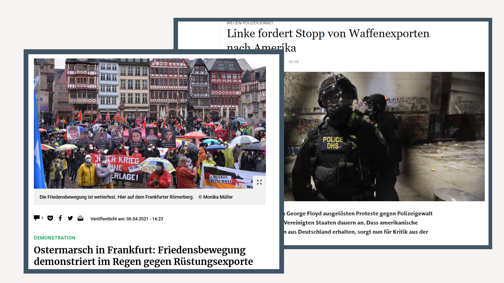
```


---

# Core Questions

```{r, echo=FALSE, fig.align='center', out.width= "90%"}
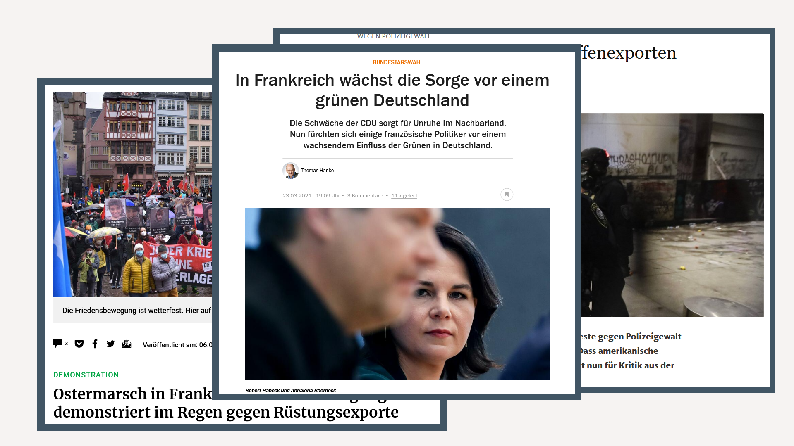
```

---

# Core Questions

.pull-left[
- Trade in arms is politically contested in democracies

  - But: This is much more visible in some than in others
  
- Arms trade allows for a value-based and interest-based perspective on foreign policy

&rightarrow; Exemplary policy field for nuanced trade-offs in decision making
]

---

# Core Questions

.pull-left[
- Trade in arms is politically contested in democracies

  - But: This is much more visible in some than in others
  
- Arms trade allows for a value-based and interest-based perspective on foreign policy

&rightarrow; Exemplary policy field for nuanced trade-offs in decision making
]

.pull-right[

<ins>Research Questions:</ins> 
  
.hl[What explains mass public preferences on weapons exports?

Why are the preferences in some countries structured seemingly differently?]
]

---

# Basis of Our Argument


- Trade in arms is 

> *"...far more than an economic occurrence, 
a military relationship, or an arms control challenge – 
arms sales are foreign policy writ large."* (Pierre 1982: 3)


- Arms trade combines elements of high and low politics

- We draw on the

  - trade literature (economic incentives; norms & values)

  - foreign policy literature (strategic interests; norms & values)

  - political economy models (strategic interests; economic incentives)
 
---

# Argument

Premise I: Citizens are neither ignorant nor elite-driven

Premise II: Citizens (foreign policy) preferences form based on interests and values

> .hl[H1:] Acceptance of arms trades should

> &nbsp;&nbsp;&nbsp;&nbsp;&rightarrow; increase with economic value

> &nbsp;&nbsp;&nbsp;&nbsp;&rightarrow; decrese with moral repulsiveness

> &nbsp;&nbsp;&nbsp;&nbsp;&rightarrow; increase with geopolitical benefits

**Open question: Which of these is more important on average?**

---

# Argument


- Moral, strategic and economic incentives interact

- Citizens can form preferences based on a consequentialist logic or on a logic of appropriateness

- These are potentially linked in two ways: 

&rightarrow; With high economic value, following through on norms is costly

&rightarrow; When the relevance of appropriateness is enhanced (decreased), the weight of moral arguments increases (decreases)


---

# Argument

Two tests for interaction effects: 

> .hl[H2:] Do respondents show lower weight of moral arguments when a lot of economic gain is at stake? 

> .hl[H3:] Do respondents show less weight for moral arguments when: 

> A) a signal of non-compliance is sent by others or 

> B) the harm potential is of the traded good is lower


---

# Argument

- Do abstract foreign policy values structure concrete arms trade policy preferences? 

> .hl[H4:] Different systematic structures of preferences for 
- militant internationalists, 
- cooperative internationalists and 
- isolationalists 


---

# Argument

- Preferences of respondents aggregate to country preferences

- This links to arguments of (elite-level) „strategic culture“

> .hl[H5:] German respondents are
- less supportive of arms deals overall, 
- show more fundamental opposition, and 
- structure preferences around norm-related dimensions (compared to French respondents) 

---

# Research Design

- Survey with 6,600 German and French respondents

- Population-representative quota sample 

- Conjoint experiment with 
  - 9 dimensions
  - 6 conjoint choice tasks, 12 rating tasks
  - and overall 79,404 observations.

- Additional survey items, vignette and ordering experiments (not reported upon here)

- PAP with power analyses can be found [here](https://osf.io/fzk52). 


---

# Conjoint Design

```{r, echo=FALSE, fig.align='center', out.width= "55%"}
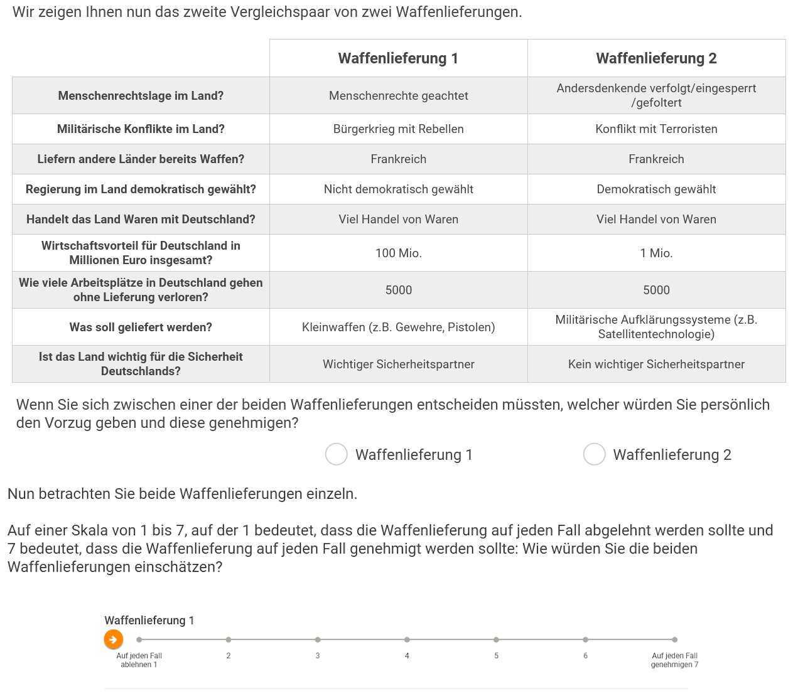
```

---

# Dimensions
.pull-left[ 
- **Norm-related**

  1\. Democracy (yes/no)
  
  2\. Human rights (upheld, violated, strongly violated)  
  
  3\. Conflict [peace, civil war, terrorists, war (attacks), war (defends)]
  
- **Geopolitical interests**

  4\. Security partner (yes/no)
]

.pull-right[ 
- **Economy-related**

  5\. Trade partner (yes/no)
  
  6\. Economic value (1m to 1bn)
  
  7\. Jobs at risk (100 to 5000)

- **Moderating factors**

  8\. Type of good (i.e. direct harm potential: yes/no)? 
  
  9\. Which other countries trade? (unkown; GER/FR; NATO; Russia/China)
] 

---

# Baseline Ratings

```{r, echo=FALSE, fig.align='center', out.width="80%"}
magick::image_read_pdf("Figs/desc_rating.pdf")
```

---

# Baseline Effects - Moral Dimensions

```{r, echo=FALSE, fig.align='center', out.width="100%"}
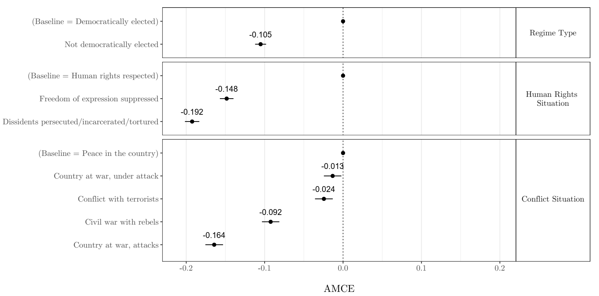
```

---

# Baseline Effects - Economic Dimensions

```{r, echo=FALSE, fig.align='center', out.width="100%"}
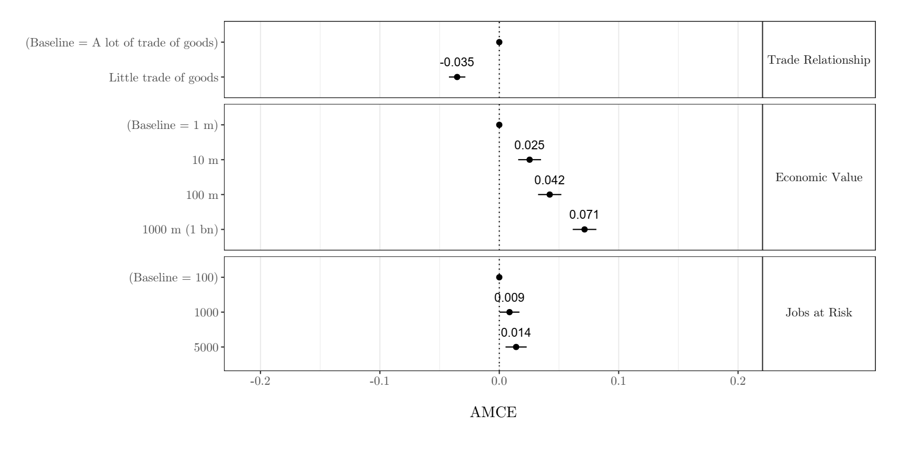
```


---
  
# Baseline Effects - Geopolitical, Type, Signal

```{r, echo=FALSE, fig.align='center', out.width="100%"}
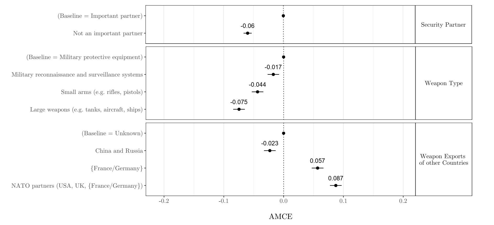
```

---

# Trade-Offs: Morals with High/Low Econ. Value

```{r, echo=FALSE, fig.align='center', out.width="80%"}
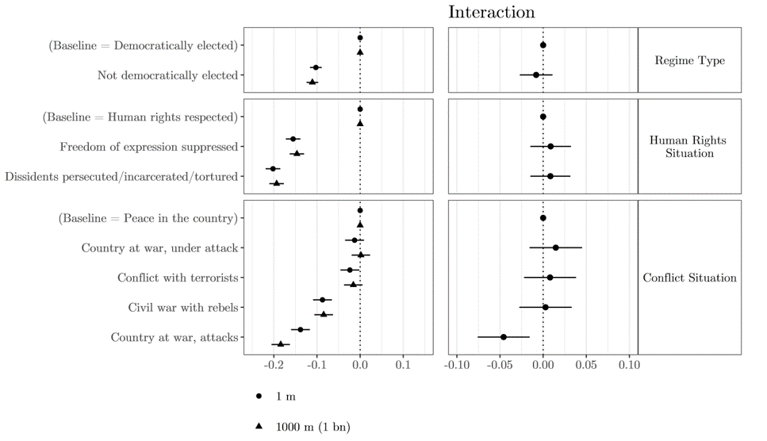
```

---

# Trade-Offs: Allies Trading

```{r, echo=FALSE, fig.align='center', out.width="70%"}
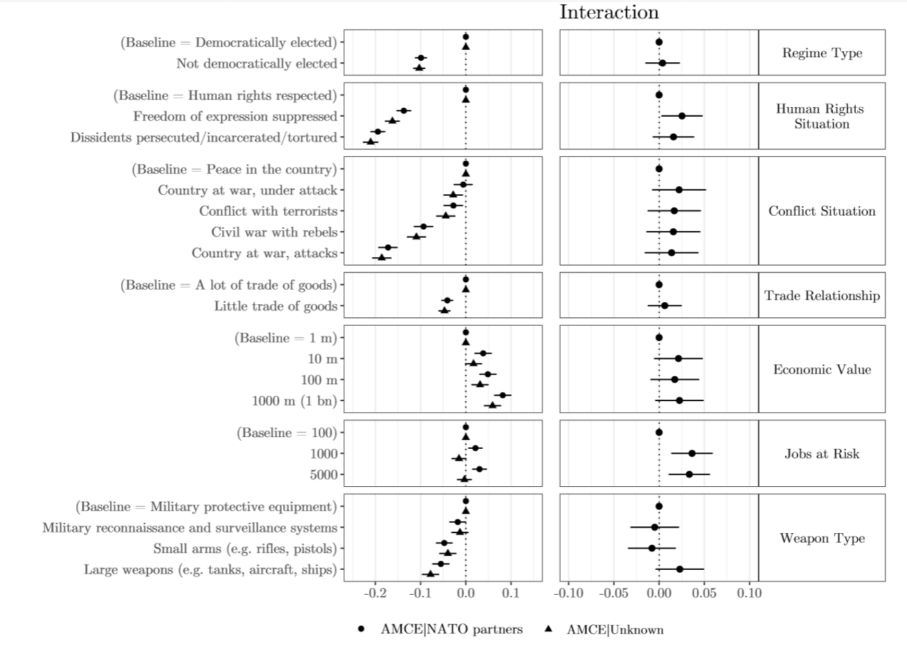
```

---

# Foreign Policy Values: Militant Internat. Subgroup

```{r, echo=FALSE, fig.align='center', out.width="80%"}
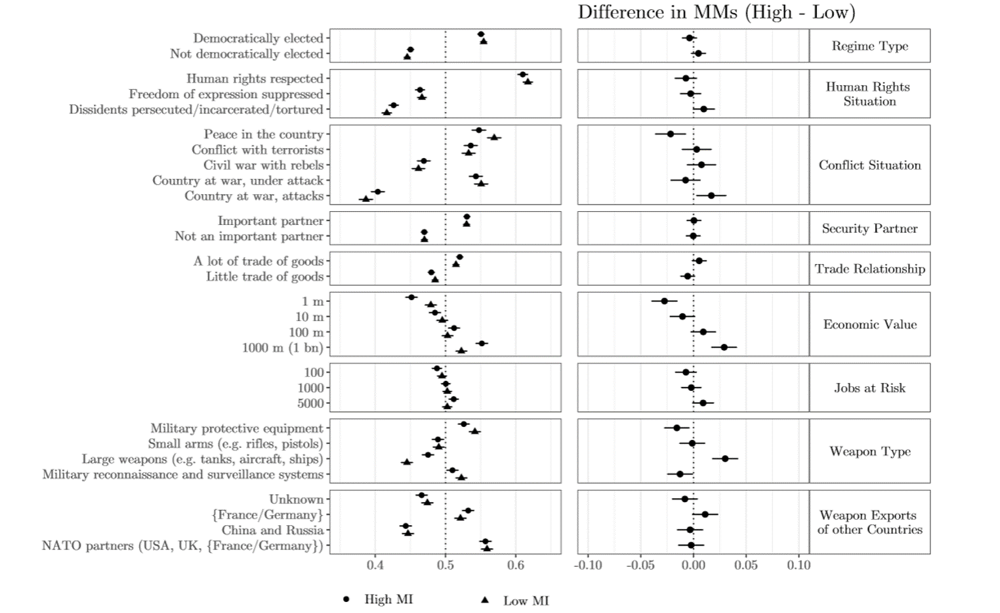
```

---

# Foreign Policy Values: Coop. Internat. Subgroup

```{r, echo=FALSE, fig.align='center', out.width="70%"}
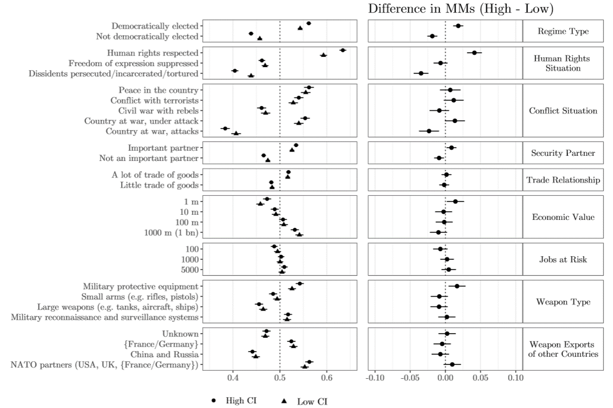
```
---

# Conjoint Attributes by Country

```{r, echo=FALSE, fig.align='center', out.width="70%"}
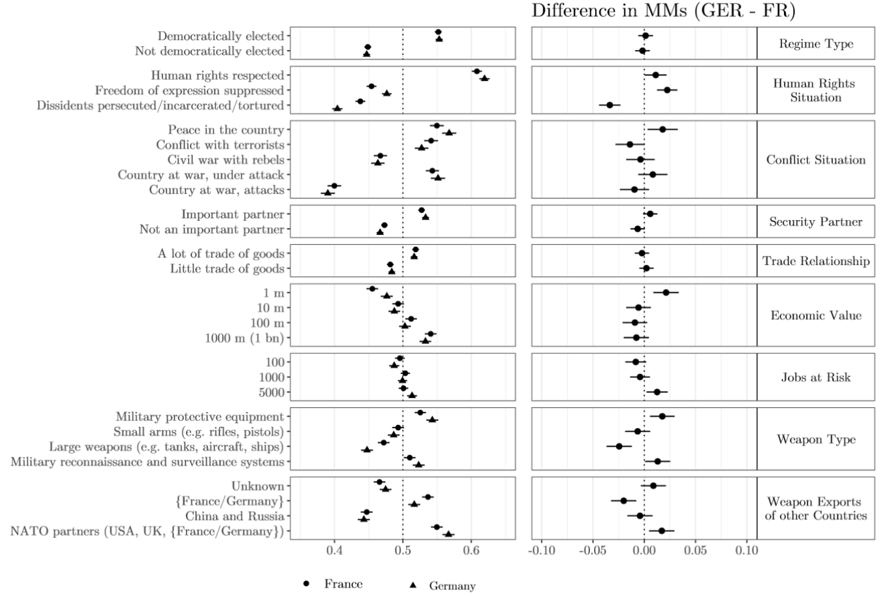
```
---

# Ratings in Germany and France

```{r, echo=FALSE, fig.align='center', out.width="70%"}
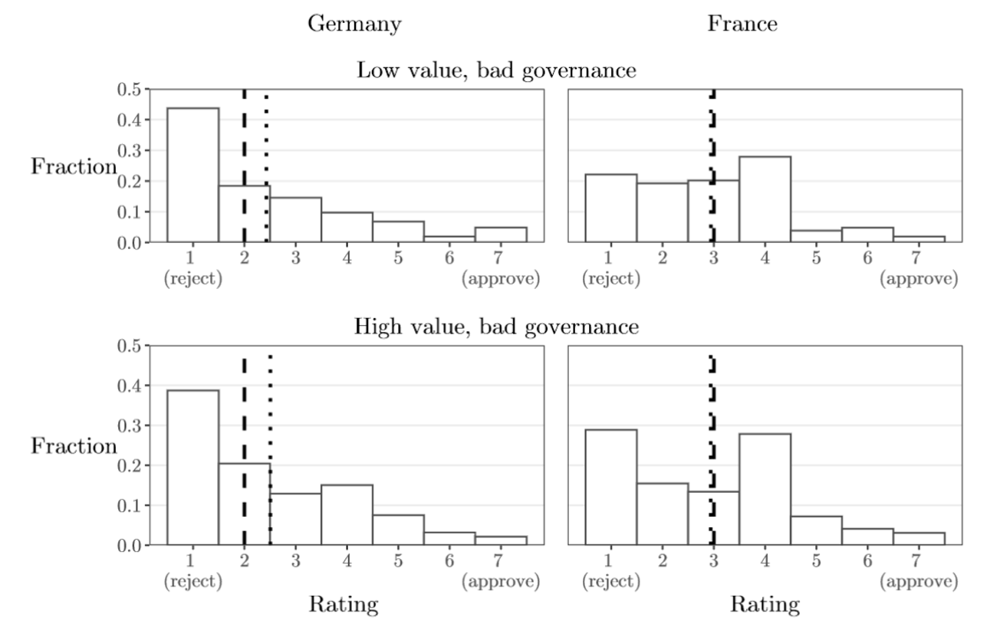
```

---

# Conclusion

.pull-left[
- Citizens hold well-structured preferences on this important and 
under-researched policy field.

- Low upper bound of support and preferences structured primarily by norm-related 
dimensions 

  &rightarrow; Public calculus and the governments' calculus appears to be regularly at odds

- No strong conditional effects. In tendency: Other countries trading 
can activate an economic logic.
]
--
.pull-right[
- Underlying foreign policy values can explain the expression of 
concrete policy choices.

- On the country level 
    - ...differences in the expression of foreign policy values link to 
    - ...differences in public attitudes, which link to
    - ...differences in (elite-level) strategic cultures.

]
---

class: inverse, center, middle

# Thank you for your attention!


### Most recent version: [`r icons::icon_style(icons::fontawesome("file-pdf"), fill = "#ffffff")`](https://osf.io/r73pv/download)


```{r print pdf, include=FALSE}

pagedown::chrome_print("./EPSA_MF.html")

```
